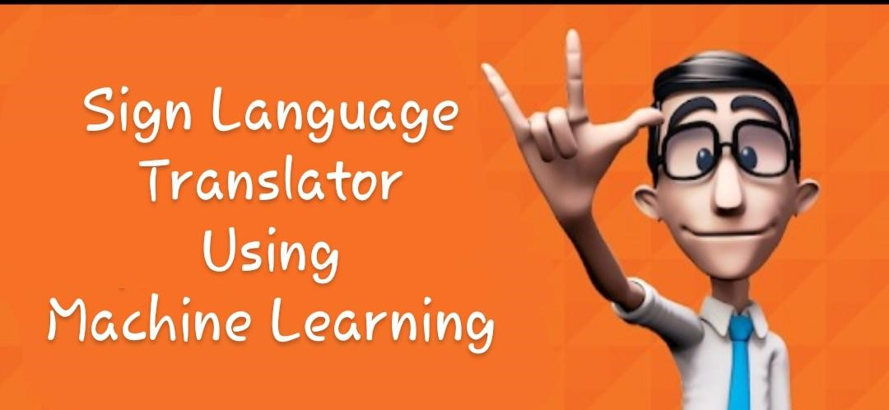

# Sign-Language-Translator

### <a href = "https://elysian01.github.io/Sign-Language-Translator/index.html"> Click Here </a> to visit website
 
  

### <a href = "https://youtu.be/TQHRHdGpT70"> Click Here </a> to watch demo 

#### Sign Language Translator enables the hearing impaired user to communicate efficiently in sign language, and the application will translate the same into text/speech.The user has to train the model, by recording the sign language gestures and then label the gesture. The user can then use the saved and recorded gestures while speaking to other people.

#### It also consists tutorial's page containing 100+ most commonly used phrases , alphabets , etc and a practice page to practice alphabets signs against a deep learning model.  

<h2>Train Your Own Sign Language</h2>
 

<h2>Practice Your Alphabet Sign Language (ASL)</h2>

### Tech Stack
* Tensorflow.js
* ML5.js & p5.js
* Javascript
* HTML & CSS

